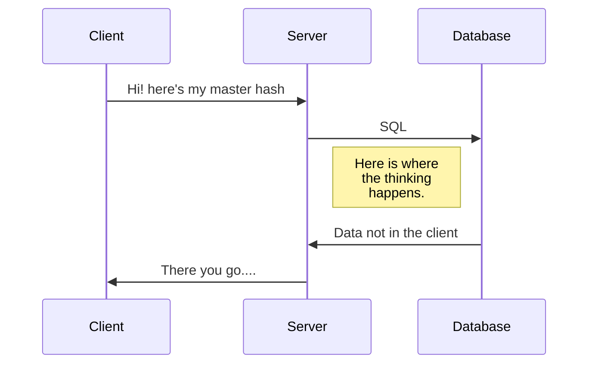

Here is how the interaction between the client/server will take place:

Murmur Hash : The master hash is the ANDed product of all the individual hashes. The hashing function used here is the murmur hash which has a lot of improvements over the normal SHA256. In NodeJS, this is how we use it.

> Written with [StackEdit](https://stackedit.io/).
<!--stackedit_data:
eyJoaXN0b3J5IjpbMTE1MDMzMTIwNCw0MDMxMjMzMjJdfQ==
-->