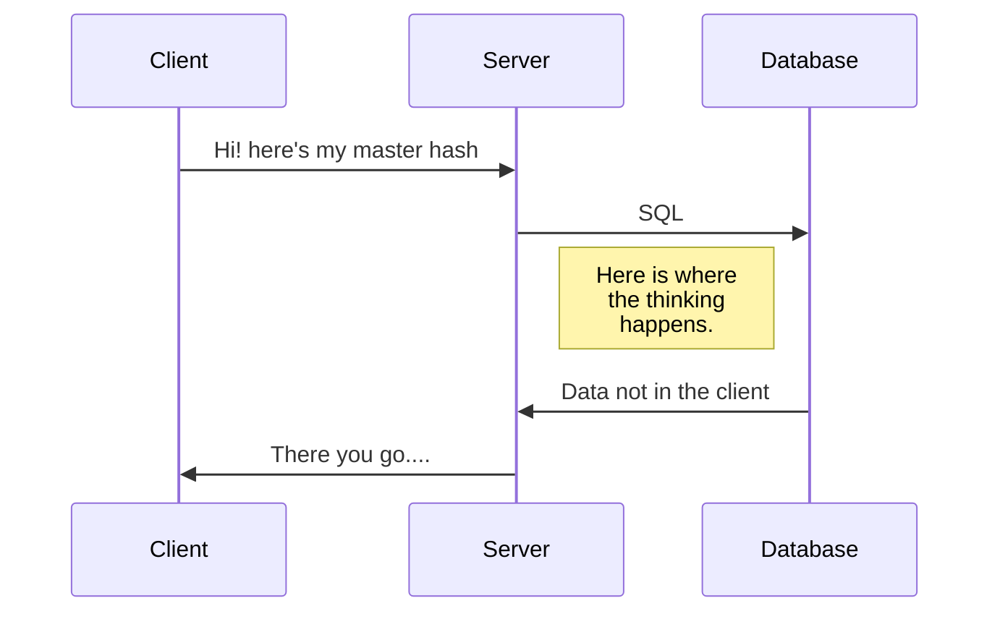

Here is how the interaction between the client/server will take place:


Murmur Hash : The master hash is the ANDed product of all the individual hashes. The hashing function used here is the murmur hash which has a lot of improvements over the normal SHA256. In NodeJS, this is how we use it.

From Murmurhash-native's npm page
```javascript
var  murmurHash  =  require('murmurhash-native').murmurHash
murmurHash( 'hash me!' ) // 2061152078
```

Now, using the same package, Lets hash a few strings:
```javascript
var  murmurHash  =  require('murmurhash-native').murmurHash

var  hash  =  murmurHash( 'hash me!' ) // 2061152078
console.log( hash );

var  hash2  =  murmurHash('do me too') // 3728646459
console.log(hash2);
``` 
Now we need to OR it since we need all the bits set from all the hashes. ORing it all together, we get:
```javascript
var  oredhash  =  hash  >>>  0  |  hash2  >>>  0 ;
oredhash  =  oredhash  >>>  0;
console.log(" Final hash : ",oredhash); // 4278103935
```


> Written with [StackEdit](https://stackedit.io/).
<!--stackedit_data:
eyJoaXN0b3J5IjpbLTE5NTcwODI1ODEsLTEwOTI2NjI0MDIsMT
E1MDMzMTIwNCw0MDMxMjMzMjJdfQ==
-->