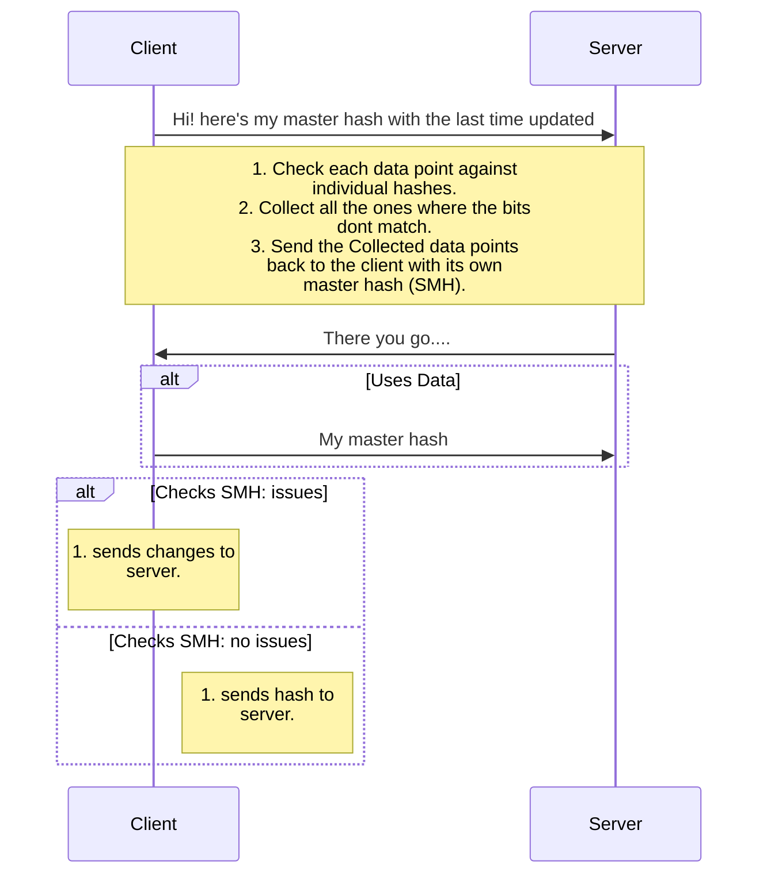
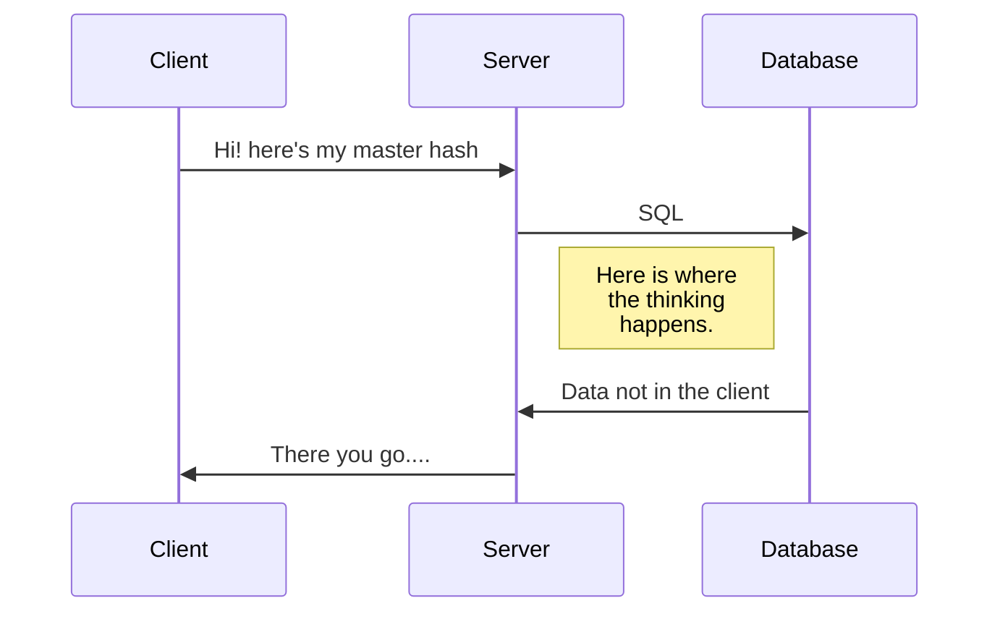

A bloom filter is a data structure which allows the server to sync data with a client with low data consumption. Another usecase is to find out uniqueness of the data. [Geekforgeeks](https://www.geeksforgeeks.org/bloom-filters-introduction-and-python-implementation/) have a pretty good explanation of bloom filters. 

My post is for syncing the data from the server to client. I am assuming that the data on the client is already updating the server as and when the data is entered. The problem statement is not the unavailability or low availability of internet. It is to minimise the syncing operation involved.

We use murmur hash since it is superfast.

Here is how the interaction between the client/server will take place:


Murmur Hash : The master hash is the ANDed product of all the individual hashes. The hashing function used here is the murmur hash which has a lot of improvements over the normal SHA256. In NodeJS, this is how we use it.

From Murmurhash-native's npm page
```javascript
var  murmurHash  =  require('murmurhash-native').murmurHash
murmurHash( 'hash me!' ) // 2061152078
```

Now, using the same package, Lets hash a few strings:
```javascript
var  murmurHash  =  require('murmurhash-native').murmurHash

var  hash  =  murmurHash( 'hash me!' ) // 2061152078
console.log( hash );

var  hash2  =  murmurHash('do me too') // 3728646459
console.log(hash2);
``` 
Now we need to OR it since we need all the bits set from all the hashes. ORing it all together, we get:
```javascript
var  oredhash  =  hash  >>>  0  |  hash2  >>>  0 ;
oredhash  =  oredhash  >>>  0;
console.log(" Final hash : ",oredhash); // 4278103935
```
Hence now we have the masterhash.

Now we need to create a few more hashes to check against the master hash. 
```javascript
var  hash3  =  murmurHash('not me!') >>>  0
console.log(hash3); //1542629515

var  hash4  =  murmurHash('do me too') >>>  0
console.log(hash4); // 3728646459
```

 Now we need to check if the bits are set both in the individual hash as well as the master hash.
 ```javascript
function  checkTheHashes( masterHash , hashToCheck ){
	var  check  = (masterHash  &  hashToCheck) >>>  0;
	//console.log(masterHash, hashToCheck, check);
	if (check  ==  hashToCheck) {
		return  true;
	} else {
		return  false;
	}
}
 ```

checking the hashes...
```javascript
check  =  checkTheHashes(oredhash, hash3);
console.log(" checking hash \"not me!\" (should be false) : ",check); // false
check  =  checkTheHashes(oredhash, hash4);
console.log(" checking hash \"do me too\" (should be true): ",check); // true
```

Now since i know it works, let me put it all in a class, so I dont pollute the global namespace.
```javascript
//TODO: make a class.
``` 
Now let us see how to utilise this. I have written a small ER diagram to see the flow of conversation:



Some reading:
<https://blog.medium.com/what-are-bloom-filters-1ec2a50c68ff>
<https://llimllib.github.io/bloomfilter-tutorial/>
<https://developer.mozilla.org/en-US/docs/Web/JavaScript/Reference/Operators/Bitwise_Operators>

> Written with [StackEdit](https://stackedit.io/).
<!--stackedit_data:
eyJoaXN0b3J5IjpbLTQ5MjQ1MTU5MywyMTM5MzM5OTgzLC0xND
MwNzk1OTgwLDE2MDg2OTcwMzAsNTE4NDY0MjkyLC0xMDkyNjYy
NDAyLDExNTAzMzEyMDQsNDAzMTIzMzIyXX0=
-->