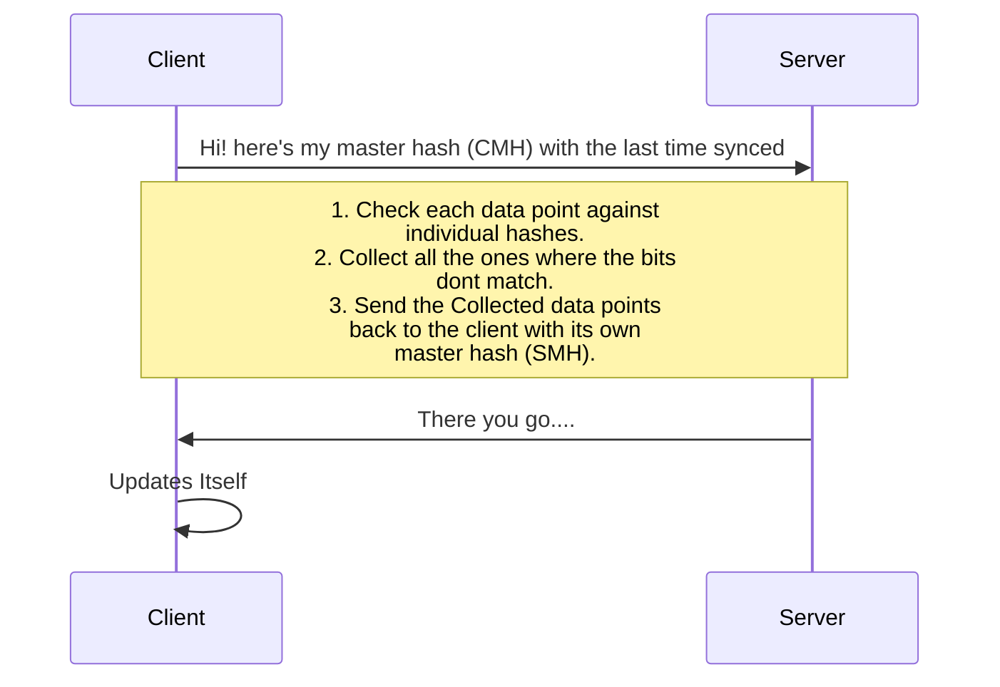

A bloom filter is a data structure which allows the server to sync data with a client with low data consumption. Another usecase is to find out uniqueness of the data. [Geekforgeeks](https://www.geeksforgeeks.org/bloom-filters-introduction-and-python-implementation/) have a pretty good explanation of bloom filters. 

My post is for syncing the data from the server to client. I am assuming that the data on the client is already updating the server as and when the data is entered. The problem statement is not the unavailability or low availability of internet. It is to minimise the syncing operation involved.

The master hash is the ANDed product of all the individual hashes. The hashing function used here is the murmur hash which has great speed improvements over the normally used  SHA256. In NodeJS, this is how we use it.

**Writing a small proof of concept with existing libraries**  

From [Murmurhash-native](https://www.npmjs.com/package/murmurhash-native)'s npm page
```javascript
var  murmurHash  =  require('murmurhash-native').murmurHash
murmurHash( 'hash me!' ) // 2061152078
```

Now, using the same package, Lets hash a few strings:
```javascript
var  murmurHash  =  require('murmurhash-native').murmurHash

var  hash  =  murmurHash( 'hash me!' ) // 2061152078
console.log( hash );

var  hash2  =  murmurHash('do me too') // 3728646459
console.log(hash2);
``` 
Now we need to OR it since we need all the bits set from all the hashes. ORing it all together, we get:
```javascript
var  oredhash  =  hash  >>>  0  |  hash2  >>>  0 ;
oredhash  =  oredhash  >>>  0;
console.log(" Final hash : ",oredhash); // 4278103935
```
Hence now we have the masterhash.

Now we need to create a few more hashes to check against the master hash. 
```javascript
var  hash3  =  murmurHash('not me!') >>>  0
console.log(hash3); //1542629515

var  hash4  =  murmurHash('do me too') >>>  0
console.log(hash4); // 3728646459
```

 Now we need to check if the bits are set both in the individual hash as well as the master hash.
 ```javascript
function  checkTheHashes( masterHash , hashToCheck ){
	var  check  = (masterHash  &  hashToCheck) >>>  0;
	//console.log(masterHash, hashToCheck, check);
	if (check  ==  hashToCheck) {
		return  true;
	} else {
		return  false;
	}
}
 ```

checking the hashes...
```javascript
check  =  checkTheHashes(oredhash, hash3);
console.log(" checking hash \"not me!\" (should be false) : ",check); // false
check  =  checkTheHashes(oredhash, hash4);
console.log(" checking hash \"do me too\" (should be true): ",check); // true
```
Now since i know it works, let me put it all in a class, so I dont pollute the global namespace.
```javascript
var bloomFilter = {
	masterHash : null,
	hashDataPoint : function( dataString ){
		hash = murmurHash( dataString ) >>>  0
		if( !isNull( masterHash )  ){
			this,masterHash = this.masterHash | hash ;
		} else {
			this.masterHash = hash;
		}
	},
	checkIfPresent : function( StringToCheck ){
	    hashToCheck = this.hashDataPoint(StringToCheck);
		var  check  = ( this.masterHash  &  hashToCheck) >>>  0;
		if (check  ==  hashToCheck) {
			return  true;
		} else {
			return  false;
		}
	}
}
``` 
I am going to use this class later.

As we can see, it is quite useful for checking uniqueness and availability of the data, depending on the answer expected is positive or negative.


---
As we are concerned with syncing data between the server and client.

Here is how the interaction between the client/server will take place:


However, the server itself consists of 2 parts. the web server and the database server. In the code examples above we saw that we can use the murmurhash to update the hash probably in a field in the same table. Along with this, we need to continuously update the master hash with each insert or update, periodically refreshing the masterhash.
```SQL
SELECT * FROM table_name HAVING hash_field_value & CMH <> hash_field_value
```
The above SQL will return only those rows from the tablename which are not there or updated in the client system.


---


Some reading:
<https://developer.mozilla.org/en-US/docs/Web/JavaScript/Reference/Operators/Bitwise_Operators>

> Written with [StackEdit](https://stackedit.io/).
<!--stackedit_data:
eyJoaXN0b3J5IjpbMTkwODQ0NzYzNCw3ODk2MTI5NjgsLTkwOD
EyODgwOCwtMTc2MjIzNDg5OCwxMjQ3Mzk0OTYzLDEyNzYxNTM3
OTIsMjEzOTMzOTk4MywtMTQzMDc5NTk4MCwxNjA4Njk3MDMwLD
UxODQ2NDI5MiwtMTA5MjY2MjQwMiwxMTUwMzMxMjA0LDQwMzEy
MzMyMl19
-->