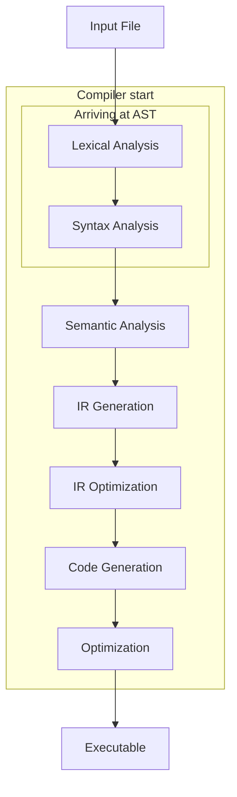
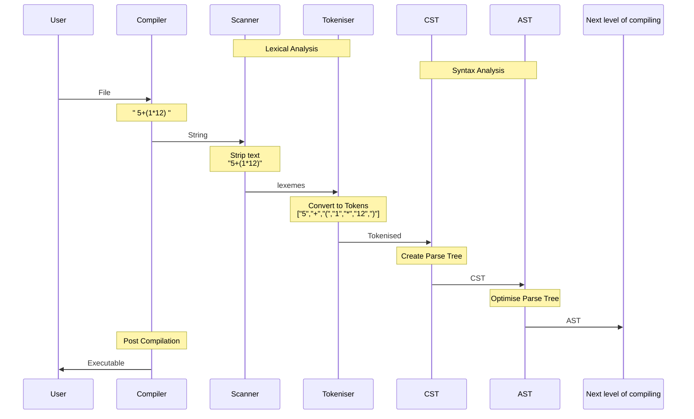

---
title: "Building a compiler-part1 AST"
date: 2019-01-27T19:00:00+05:30
draft: false
tags : [CompSci,compilerTheory,AST]
Description : "Building your own compiler (Part 1)"
---  
**Building blocks of a compiler**:
Copied from <https://www.programcreek.com/2011/02/how-compiler-works/>
>A compiler is a computer program that transforms source code written in a high-level programming language into a lower level language.  

Here is what happens in a compiler

Lexical Analysis, Syntax Analysis, Semantic Analysis, IR Generation, IR Optimization, Code Generation, Optimization


**How do you get to an AST**
Below diagram is based on [Vaidehi Joshi's](https://medium.com/basecs/leveling-up-ones-parsing-game-with-asts-d7a6fc2400ff) awesome post on ASTs:
As she has, we will be using the same example for our input " 5+(1*12) "



* CST : Concrete Syntax tree
	```mermaid
	graph TD
		A1["Exp"]
		A1-->A[5]
		A1-->B["+"]
		A1-->A2[Exp]
		A2-->C["("]
		A2-->A3["Exp"]
		A2-->G[")"]
		A3-->D[1]
		A3-->E["*"]
		A3-->F[12]
	```
* AST : Abstract Syntax tree
    ```mermaid
	graph TD
		B["+"]
		B-->A[5]
	        B-->E(*)
	        E-->D(1)
	        E-->F(12)
    ```
To understand and see these in action, Do try out <https://astexplorer.net/>. This site is amazing and will make you see in action building of an AST with code.  Read [this](https://blog.buildo.io/a-tour-of-abstract-syntax-trees-906c0574a067) to figure out the why's and what's.

Many thanks to the creators of  <https://mermaidjs.github.io> for the sequence diagram. It is truly a pleasure to work with.  

more reading:
<https://medium.com/basecs/grammatically-rooting-oneself-with-parse-trees-ec9daeda7dad>


> Written with [StackEdit](https://stackedit.io/).
<!--stackedit_data:
eyJoaXN0b3J5IjpbMTU1ODQ1MzM5Miw3NDA3NzQ2OTksNzQ2OT
A1NjgyLC0xNjc1MTU2NzM1LC0xMDgzOTkyNjcyLDE4NjQ5MjM0
NTUsLTM0MDIwNzMxMSw0NjMzNjAwNjEsLTQxNDc0Njc2NSwtMT
YyMzI1NDM2MSwxNTEzNzIwNzU5LDE1ODUyNjcxNDQsODMxNzcy
MzBdfQ==
-->