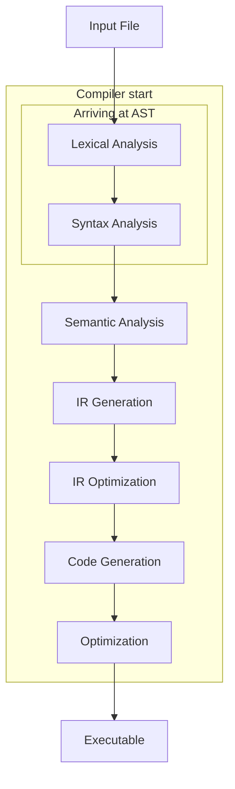
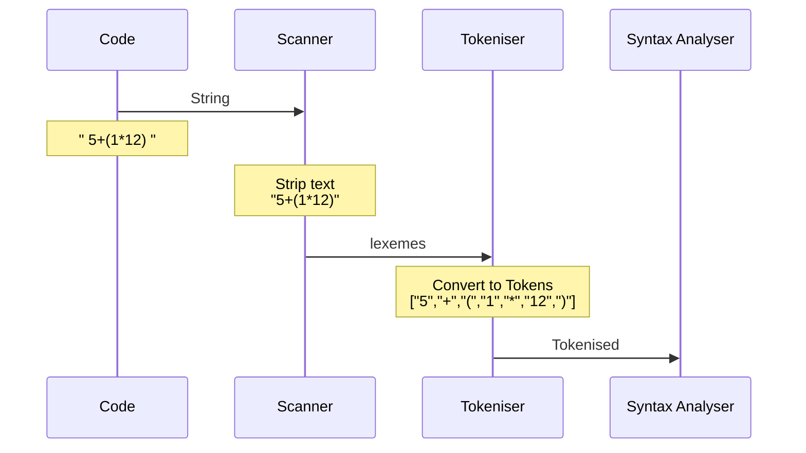
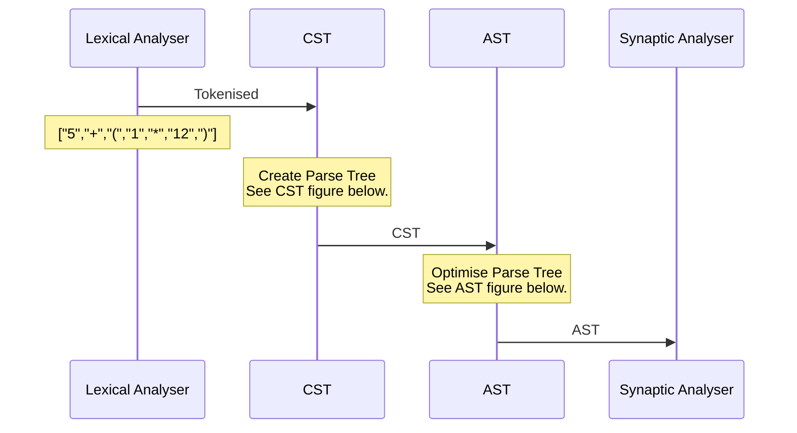

---
title: "Building a compiler-part1 AST"
date: 2019-01-27T19:00:00+05:30
draft: false
tags : [CompSci,compilerTheory,AST]
Description : "Building your own compiler (Part 1)"
---  
**Building blocks of a compiler**:
Copied from <https://www.programcreek.com/2011/02/how-compiler-works/>
>A compiler is a computer program that transforms source code written in a high-level programming language into a lower level language.  

Here is what happens in a compiler


This post covers Lexical Analyser and Syntax analyser. 

Below diagram is based on [Vaidehi Joshi's](https://medium.com/basecs/leveling-up-ones-parsing-game-with-asts-d7a6fc2400ff) awesome post on ASTs:
As she has, we will be using the same example for our input `" 5+(1*12) "`. This will form a  continuity if you decide to visit her blogpost.

**Lexical Analysis**
The lexical analyzer breaks the input file or sentence into a series of tokens, by removing or adding any whitespace or comments in the source code. So it should have these stages:



**Syntax Analysis**
At its very basic, a Syntax analyser converts tokens to a parse tree by looking at a set of rules. This is a simplification so that we can understand the basic functionlity of this stage of a compiler.
There are 2 stages to this:
1. Getting a parse tree out.
2. Optimising the parse tree.

Again, do have a look at [Vaidehi Joshi's](https://medium.com/basecs/grammatically-rooting-oneself-with-parse-trees-ec9daeda7dad) fantastic post on parse trees. Its extremely well written.



* **CST : Concrete Syntax tree** - So This stage comes up with a parse tree. How does it do that? It looks at the expression and sees which rule it will agree with. This "see which rule it will agree with" bit is to  see which kind of token parsing is being used. The types of token parsing and its implications are again not in the scope of this article; so we will assume that it uses LR (Left to Right) parsing  
	```mermaid
	graph TD
		A1["Exp"]
		A1-->A[5]
		A1-->B["+"]
		A1-->A2[Exp]
		A2-->C["("]
		A2-->A3["Exp"]
		A2-->G[")"]
		A3-->D[1]
		A3-->E["*"]
		A3-->F[12]
	```
* AST : Abstract Syntax tree
    ```mermaid
	graph TD
		B["+"]
		B-->A[5]
	        B-->E(*)
	        E-->D(1)
	        E-->F(12)
    ```
To understand and see these in action, Do try out <https://astexplorer.net/>. This site is amazing and will make you see in action building of an AST with code.  Read [this](https://blog.buildo.io/a-tour-of-abstract-syntax-trees-906c0574a067) to figure out the why's and what's.

Many thanks to the creators of  <https://mermaidjs.github.io> for the sequence diagram. It is truly a pleasure to work with.  

more reading:
<https://medium.com/basecs/grammatically-rooting-oneself-with-parse-trees-ec9daeda7dad>


> Written with [StackEdit](https://stackedit.io/).
<!--stackedit_data:
eyJoaXN0b3J5IjpbLTc5MjA1Mzc1OCwxNDE0OTI4NjY3LC0yOT
g3MzI4MzEsMTI4NjM2MzQ0NywxNTU4NDUzMzkyLDc0MDc3NDY5
OSw3NDY5MDU2ODIsLTE2NzUxNTY3MzUsLTEwODM5OTI2NzIsMT
g2NDkyMzQ1NSwtMzQwMjA3MzExLDQ2MzM2MDA2MSwtNDE0NzQ2
NzY1LC0xNjIzMjU0MzYxLDE1MTM3MjA3NTksMTU4NTI2NzE0NC
w4MzE3NzIzMF19
-->