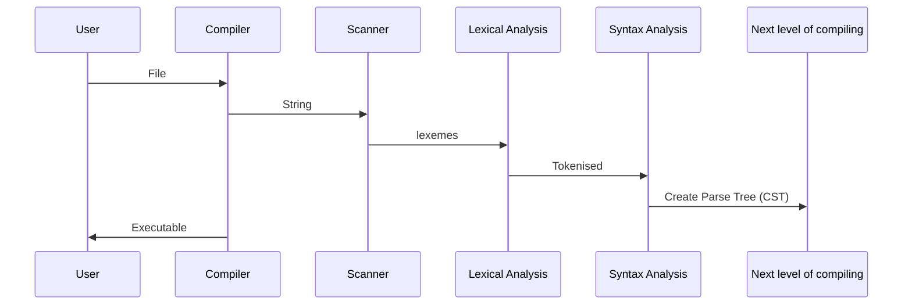

---
title: "Building a compiler-part1. AST"
date: 2019-01-27T19:00:00+05:30
draft: false
tags : [CompSci,compilerTheory,AST]
Description : "Building your own compiler (Part 1): How to build a Abstract Syntax Tree"
---  
**What is an AST?**:

**Define your rules**:  

---  
**Define your grammer**:  

Below diagram is based on [Vaidehi Joshi's](https://medium.com/basecs/leveling-up-ones-parsing-game-with-asts-d7a6fc2400ff) awesome post on ASTs:

* CST : Concrete Syntax trees
* 

To understand and see these in action, Do try out <https://astexplorer.net/>. This site is amazing and will make you see in action building of an AST.  

Many thanks to <https://mermaidjs.github.io> for the sequence diagram. It is truly a pleasure to work with.  

> Written with [StackEdit](https://stackedit.io/).
<!--stackedit_data:
eyJoaXN0b3J5IjpbLTE3MTU0Nzc3MTgsLTQxNDc0Njc2NSwtMT
YyMzI1NDM2MSwxNTEzNzIwNzU5LDE1ODUyNjcxNDQsODMxNzcy
MzBdfQ==
-->