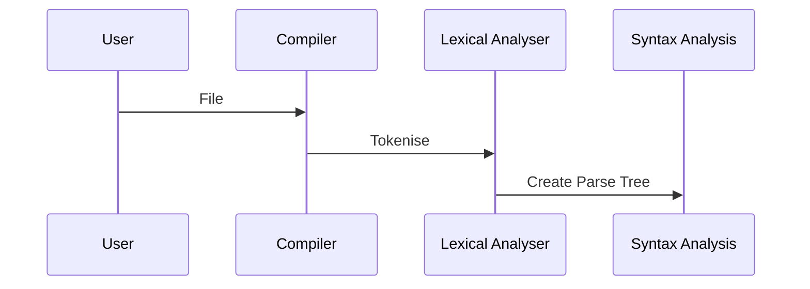

---
title: "Building a compiler-part1. AST"
date: 2019-01-27T19:00:00+05:30
draft: false
tags : [CompSci,compilerTheory,AST]
Description : "Building your own compiler (Part 1): How to build a Abstract Syntax Tree"
---  
**What is an AST?**:

**Define your rules**:  

---  
**Define your grammer**:  

> Written with [StackEdit](https://stackedit.io/).
<!--stackedit_data:
eyJoaXN0b3J5IjpbMTUxMzcyMDc1OSwxNTg1MjY3MTQ0LDgzMT
c3MjMwXX0=
-->